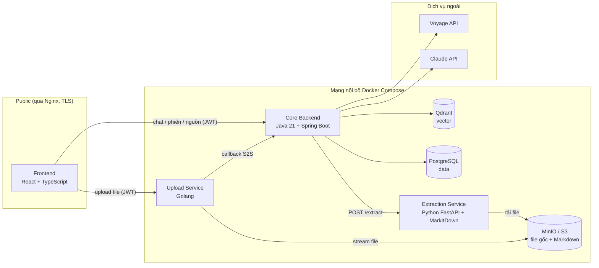
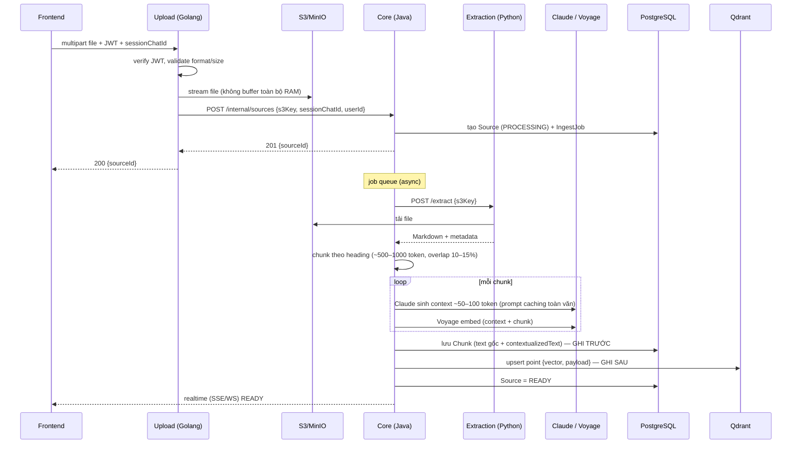
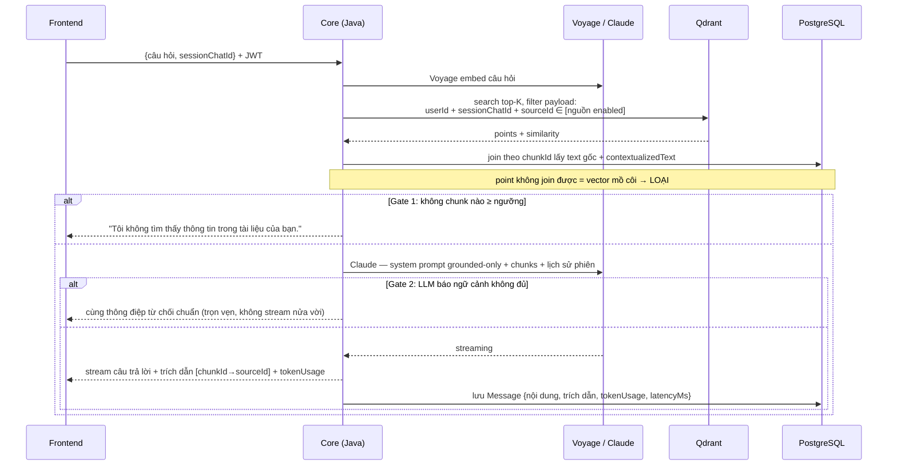

# DocMate — Architecture

| | |
|---|---|
| **Phiên bản** | 1.0 — 2026-07-06 |
| **Tham chiếu** | `PRD-docmate-v1.3.md` §5–§6 · `08-erd.md` · `09-adr-001-postgres-qdrant.md` |
| **Phạm vi** | Chi tiết hóa kiến trúc từ PRD tới mức code-theo-được: ranh giới service, hợp đồng API nội bộ, luồng chính, nguyên tắc dual-write |

---

## 1. Sơ đồ tổng thể



**Nguyên tắc ranh giới (bất biến):**

| Service | Chỉ làm | Tuyệt đối không làm |
|---|---|---|
| **Upload Service (Golang)** | Xác thực JWT, validate file (extension + MIME + size ≤ 50MB), stream lên S3, callback Java | Logic nghiệp vụ, đọc/ghi PostgreSQL/Qdrant, gọi AI |
| **Core Backend (Java)** | Auth, API chat/phiên/nguồn, orchestration pipeline ingest, RAG, token accounting, mọi truy cập PostgreSQL + Qdrant | Nhận file trực tiếp từ client, extract nội dung |
| **Extraction Service (Python)** | File/URL → Markdown + metadata; fetcher URL + chống SSRF (từ US-2.4) | Trạng thái (stateless tuyệt đối), truy cập DB, biết khái niệm user/phiên |

**Chỉ Nginx expose ra ngoài.** Mọi giao tiếp service-to-service đi trong mạng Docker nội bộ.

## 2. Hợp đồng API nội bộ

> Mức chi tiết: endpoint + schema chính, đủ để code theo. Spec máy-đọc (OpenAPI) sinh từ code khi hiện thực.

### 2.1. Golang → Java: callback sau upload

```
POST /internal/sources
Headers:
  X-Internal-Token: <shared secret>          # xác thực S2S, xem §2.3
Body:
{
  "s3Key":         "uploads/{userId}/{uuid}/{filename}",
  "sessionChatId": "uuid",
  "userId":        "uuid",                    # Golang lấy từ JWT đã verify
  "metadata": {
    "fileName":    "hop-dong.pdf",
    "mimeType":    "application/pdf",
    "sizeBytes":   1048576
  }
}
→ 201 { "sourceId": "uuid" }                  # Java đã tạo Source (PROCESSING) + đẩy job
→ 401 nếu S2S token sai · 404 nếu sessionChatId không tồn tại/không thuộc userId
→ 409 nếu s3Key đã đăng ký (chống callback lặp — idempotency theo s3Key)
```

**Retry phía Golang:** N lần với backoff; hết N lần → dọn file S3 (hoặc đánh dấu orphan cho job dọn) + trả lỗi cho client (AC US-0.7).

### 2.2. Java → Python: extraction

```
POST /extract
Body (một trong hai):
  { "s3Key": "uploads/..." }                  # file — Python tự tải từ S3
  { "url": "https://..." }                    # URL — fetcher chạy tại Python (chống SSRF từ US-2.4)
→ 200 {
  "markdown":  "...",
  "metadata": {
    "format": "pdf", "sizeBytes": 1048576, "pages": 12,
    "processingMs": 3200
  }
}
→ 4xx { "errorCode": "UNSUPPORTED_FORMAT" | "CORRUPTED_FILE" | "FETCH_FAILED"
        | "SSRF_BLOCKED" | "SIZE_EXCEEDED", "detail": "..." }
```

Không bao giờ 500 trần — mọi lỗi dự đoán được phải có `errorCode` phân loại (AC US-0.2). Java map `errorCode` → lý do FAILED dễ hiểu hiển thị trên panel (AC US-2.3).

### 2.3. Xác thực service-to-service

- **v1: shared secret** qua header `X-Internal-Token`, cấp qua env, so sánh constant-time. Đơn giản, đủ cho mạng Docker nội bộ không expose.
- Nâng cấp mTLS chỉ khi tách service ra ngoài một máy — ghi nhận là quyết định hoãn, không làm sớm.
- JWT người dùng: Java phát hành (HS256/RS256 — chọn khi hiện thực US-1.2), Golang verify cùng khóa/public key qua env chung. Claims tối thiểu: `sub` (userId), `exp`, `iat`.

## 3. Luồng ingest (sequence)



**Xử lý lỗi trong pipeline:** mỗi bước lỗi tạm thời (timeout, rate-limit Claude/Voyage) → retry với backoff; quá N lần → Source = FAILED + `errorCode` phân loại; token đã tiêu cho contextual vẫn được log vào IngestJob (AC US-2.2).

## 4. Luồng query (sequence)



**Danh sách nguồn enabled** lấy từ PostgreSQL (cờ `enabled` trên Source) tại thời điểm mỗi câu hỏi — bật/tắt có hiệu lực ngay câu kế tiếp (AC US-3.3).

## 5. Dual-write PostgreSQL ↔ Qdrant — quy tắc cứng

Nguyên tắc nền (PRD §5.1, ADR-001): **thà thiếu vector còn hơn thừa** — trạng thái lỗi giữa chừng luôn phải nghiêng về phía "không truy xuất được", không bao giờ nghiêng về "truy xuất được dữ liệu đã xóa".

### 5.1. Thứ tự thao tác

| Thao tác | Thứ tự bắt buộc | Vì sao |
|---|---|---|
| **Ghi chunk mới** | 1. Insert PostgreSQL → 2. Upsert Qdrant | Fail giữa chừng → có text, thiếu vector → chunk không xuất hiện trong search (an toàn). Job đối soát re-embed sau |
| **Xóa Source** | 1. Delete PostgreSQL (cascade Chunk/Message) → 2. Delete Qdrant theo payload `sourceId` → 3. Delete S3 | Fail sau bước 1 → vector mồ côi trên Qdrant, nhưng join lại Postgres sẽ loại nó khỏi mọi kết quả (an toàn). Job đối soát dọn sau |
| **Xóa Session / Account** | Như trên, delete Qdrant theo payload `sessionChatId` / `userId` | Cùng logic |

### 5.2. Ba lớp phòng thủ

1. **Join bắt buộc:** kết quả search Qdrant **luôn** join lại PostgreSQL theo `chunkId` trước khi dùng — không có đường tắt "lấy text từ payload" (payload không chứa text chính vì lý do này).
2. **Job đối soát định kỳ:** scroll point trên Qdrant theo batch → kiểm `chunkId` tồn tại trong PostgreSQL → xóa point mồ côi; đồng thời phát hiện chunk thiếu vector → re-embed. Tần suất: hàng ngày (cấu hình được).
3. **Test bắt buộc trong DoD:** "xóa rồi hỏi lại" — mọi story có xóa dữ liệu phải pass (xem `04-dor-dod.md` §2.2).

## 6. Cấu hình & secret

| Nhóm | Cách quản lý |
|---|---|
| API key (Claude, Voyage, OpenAI dự phòng), S3 credentials, JWT key, S2S shared secret | Env qua `.env` (dev) / secret của môi trường deploy (prod) — không hardcode, không commit |
| Tham số RAG (ngưỡng similarity Gate 1, top-K, budget token ngữ cảnh, model trả lời, model sinh context) | Config Java, đổi được không cần build lại; tinh chỉnh bằng bộ test vàng (US-0.6) |
| Provider embedding | Interface `EmbeddingProvider` (PRD §6.4), chọn qua config; mỗi chunk lưu `embeddingModel` + `dimension` |

## 7. Observability

- **Logging có cấu trúc** (JSON) cả 3 service; correlation id truyền xuyên Golang → Java → Python qua header (`X-Request-Id`).
- **Metric tối thiểu v1:** thời gian ingest p50/p95 theo định dạng, tỉ lệ FAILED theo `errorCode`, first-token latency, token usage theo request/phiên.
- **Health:** endpoint health cả 3 service + healthcheck container Postgres/Qdrant/MinIO (đã có từ US-0.1).

## Changelog

| Phiên bản | Ngày | Thay đổi |
|---|---|---|
| 1.0 | 2026-07-06 | Bản đầu — chi tiết hóa từ PRD v1.3 §5–§6 |
