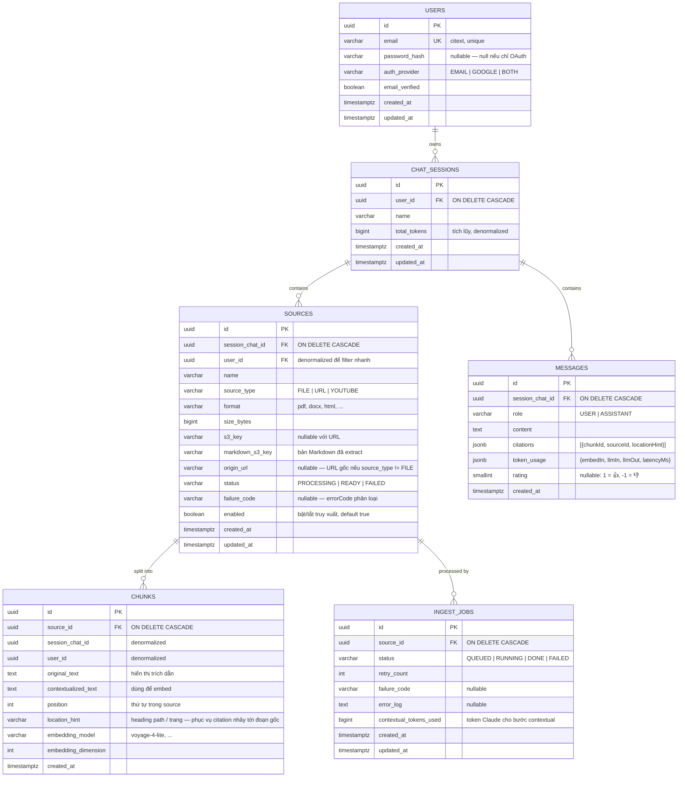

# DocMate — ERD & Data Model

| | |
|---|---|
| **Phiên bản** | 1.0 — 2026-07-06 |
| **Tham chiếu** | `PRD-docmate-v1.3.md` §7 · `07-architecture.md` §5 · `09-adr-001-postgres-qdrant.md` |
| **Phạm vi** | Schema PostgreSQL (nguồn sự thật của US-0.3) + mapping sang Qdrant payload |

---

## 1. ERD (PostgreSQL)



## 2. Chuỗi cascade

```
users ──┬─► chat_sessions ──┬─► sources ──┬─► chunks
        │                   │             └─► ingest_jobs
        │                   └─► messages
```

Xóa user → mất tất cả. Xóa session → mất sources + messages + (qua sources) chunks + ingest_jobs. Xóa source → mất chunks + ingest_jobs. **Toàn bộ bằng FK `ON DELETE CASCADE` — không xóa bằng code ứng dụng** (code ứng dụng chỉ lo phần ngoài Postgres: Qdrant theo payload + S3, xem `07-architecture.md` §5.1).

## 3. Ghi chú thiết kế

| Quyết định | Lý do |
|---|---|
| `user_id` denormalized xuống `sources` và `chunks` | Filter cô lập dữ liệu (`userId` + `sessionChatId`) ở tầng thấp nhất không cần join ngược; NFR cô lập là yêu cầu cứng |
| `chunks` không có cột vector | Vector sống ở Qdrant (ADR-001). Không dùng pgvector song song để tránh 2 nguồn sự thật |
| Text chính KHÔNG nằm trong Qdrant payload | Ép mọi đường đọc text đi qua join PostgreSQL — cơ chế loại vector mồ côi (07 §5.2) |
| `citations` và `token_usage` là `jsonb` trên `messages` | Cấu trúc đọc-nhiều-ghi-một, không cần query quan hệ phức tạp; tổng token phiên tính từ `token_usage` (AC US-3.5) |
| `total_tokens` denormalized trên `chat_sessions` | Panel hiển thị tổng token phiên không cần aggregate toàn bộ messages mỗi lần mở |
| `location_hint` trên `chunks` | Citation click được phải nhảy tới đoạn gốc trong panel (AC US-4.1) — cần vị trí người-đọc-hiểu (heading/trang), không chỉ `position` |
| `failure_code` tách khỏi `error_log` | Code phân loại cho UI (lý do dễ hiểu — AC US-2.3); log thô cho debug |
| Email dùng `citext` | So sánh không phân biệt hoa thường ở mức DB, tránh tài khoản trùng khác hoa thường |

## 4. Index đề xuất

| Bảng | Index | Phục vụ |
|---|---|---|
| `chat_sessions` | `(user_id, updated_at DESC)` | Danh sách phiên bên trái |
| `sources` | `(session_chat_id, created_at)` · `(session_chat_id, enabled) WHERE status = 'READY'` | Panel nguồn; lấy danh sách nguồn enabled mỗi câu hỏi |
| `chunks` | `(source_id, position)` · PK `id` dùng cho join từ Qdrant | Preview theo thứ tự; join batch theo `chunkId` sau search |
| `messages` | `(session_chat_id, created_at)` | Lịch sử hội thoại |
| `ingest_jobs` | `(status, updated_at)` | Job queue quét việc |

> Join sau search Qdrant là `WHERE id IN (top-K chunkId)` — K nhỏ (≤ ~20), PK lookup, không cần index thêm.

## 5. Mapping PostgreSQL ↔ Qdrant

**Collection:** `docmate_chunks` (một collection duy nhất, multi-tenant bằng payload filter).

| Qdrant | Giá trị | Ghi chú |
|---|---|---|
| `point.id` | = `chunks.id` (UUID) | Khớp nối 1-1, cũng là khóa join |
| `point.vector` | Voyage embed(`contextualized_text`) | Dimension theo `embedding_dimension` |
| `payload.userId` | = `chunks.user_id` | **Payload index** — filter cô lập user |
| `payload.sessionChatId` | = `chunks.session_chat_id` | **Payload index** — filter theo phiên |
| `payload.sourceId` | = `chunks.source_id` | **Payload index** — filter nguồn enabled + delete theo source |
| `payload.chunkId` | = `chunks.id` | Trùng point.id, giữ tường minh để join |

**Không có trong payload (cố ý):** `original_text`, `contextualized_text` — xem §3.

**Thao tác delete theo payload:**

| Sự kiện | Filter delete trên Qdrant |
|---|---|
| Xóa Source | `sourceId == X` |
| Xóa Session | `sessionChatId == X` |
| Xóa Account | `userId == X` |

## 6. Ràng buộc nhất quán (nhắc lại từ 07 §5)

- Ghi: Postgres trước, Qdrant sau. Xóa: Postgres trước, Qdrant sau, S3 cuối.
- Search: Qdrant → join Postgres theo `chunkId` → point không join được bị loại.
- Job đối soát định kỳ: dọn point mồ côi + re-embed chunk thiếu vector.

## Changelog

| Phiên bản | Ngày | Thay đổi |
|---|---|---|
| 1.0 | 2026-07-06 | Bản đầu — schema chi tiết từ PRD v1.3 §7, đầu vào cho migration US-0.3 |
